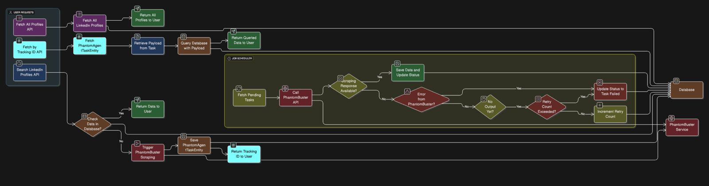

# LinkedIn profile Data Searcher

**This Repository is a sprint boot microservice that has APIs related to searching and scrapping of Alumni linkedIn profiles**

**Tools and Technologies used:**

+ **Java 17**
+ **Spring boot 3.5.3**
+ **PostGreSQL 17.5**
+ **Gradle 8.14.2**
+ **flyway 11.7.2**
+ **pojo tester 0.9.0**
+ **mapstruct 1.6.3**
+ **Junit 5**

**Basic Execution Flow:**

There are 3 APIs in this microservice.

1. /api/v1/linked-in/search -> which accepts payload that includes universityName, graduationYear and CurrentDesignation
   + This API accepts the paylaod and searches whether the response is present in db or not
       + If present, return the response to the client
       + else trigger PhantomBuster LinkedIn search export phantom, save the PhantomAgentTask and return tracking id.
   + There is a scheduled job in the microservice which runs for every 2 minutes (configurable based on the traffic) and picks the phantomAgentTaskEntities that are pending, extracts phantom container id from them and triggers phantoms API to fetch the profile response.
   + If response is present, save the response in db and mark PhantomAgentTask Completed.
   + If error occurred, mark the phantomAgentTask failed.
   + If no response/still scraping, increment the retry count of PhantomAgentTask, if retry count is already incremented mark task as failed.

2. /api/v1/linked-in/fetch/{trackingId}
   + This Api returns the saved data that job saves by fetching it from PhantomBuster using trackingId.
   + Pass the trackingId you got in /api/v1/linked-in/search apis response.
   + If the data is available the api returns the Alumni LinkedIn profile data.
   + If the task got marked as failed by the job, returns error.
   + If the task still in pending state, gives relevant message.

3. /api/v1/linked-in/fetch/all
   + This API is used to fetch all the Alumni LinkedIn profile data from the database.

**How to run the Microservice🚀: **

+ clone the repository
+ Export the following Environment variables before running the microservice.
  + POSTGRES_DATABASE_HOST - if not given localhost is considered as default
  + POSTGRES_DATABASE_PORT - if not given 5432 is considered as default
  + POSTGRES_DATABASE_NAME - create a postgres data base manually and give its name here
  + POSTGRES_DATABASE_USERNAME - if not given postgres is considered as default
  + POSTGRES_DATABASE_PASSWORD - give password for your postgres db
  + PHANTOM_ID - give if you want to test this on a self configured phantom or else falls back to default phantom
  + PHANTOM_BUSTER_API_KEY - give your PhantomBuster api key, or else mine will be used as default
  + LINKED_IN_SESSION_COOKIE - give li_at cookie from your linkedIn (mandatory).
+ After Exporting all these environment variable you'll be able to run the application on 8080 port.
+ Look for the swagger url in the application logs and navigate to swagger. That's it, Happy scrapping.

